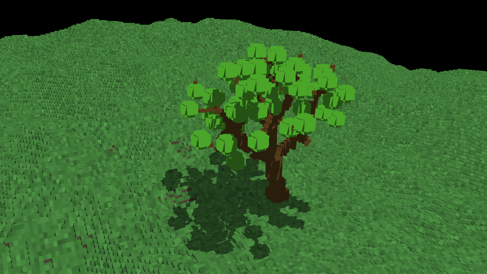

Vulkan Voxel Tracer
==================

## Description

Real-time voxel tracer using Vulkan, written from scratch in Rust.
Makes use of [ash](https://crates.io/crates/ash) for Vulkan bindings, [winit](https://crates.io/crates/winit) for window creation, [specs](https://crates.io/crates/specs) for ECS and [nalgebra](https://crates.io/crates/nalgebra) for linear algebra.

Currently all voxel data is stored in a giant pre-generated 3D texture (`assets/world`), but it will be updated to use an SVO.
The structure of the voxel data is 32 bit integers, where the 24 least significant bits represent 8-bit RGB color.
The remaining 8 bits store transparancy and reflectivity respectively.

## Usage

To run the program, first compile the GLSL shaders located in `shaders/src` to SPIR-V (e.g. using [shaderc](https://github.com/google/shaderc)) and place them in `shaders/spv` with the suffix `.spv`.
Then it should be built and run like any other Rust program.

## Controls

WASD - Regular movement controls

QE - Move up/down

G - Grow the tree

## Screenshots

Early attempt at tree generation resulted in some kind of fireball.

Successful tree generation using Space Colonization.

Demonstration of transparent glass-like voxels.

Demonstration of reflective metal-like voxels.

Pink light illuminating the tree.

All the above effects at once.
